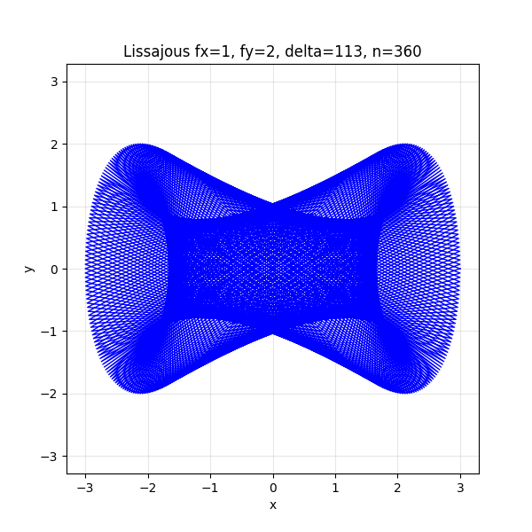

# York University HP Plotter Art, 1970
*Arthur Ryman, arthur.ryman@torontomu.ca, 2025-12-01*

## Background

On 2024-10-26 I received the following email from Zbigniew Stachniak:
> I'm a senior scholar at York University and the curator of York University Computer Museum.
I'm writing to you hoping that you are the Arthur Ryman who, as physics student at York U 
in the early 1970s, was involved with plotter art, publishing some of the artwork on the
covers of York's Computer Centre Users' Newsletter. 

He sent me the following scanned image:

Yes, that was me. 
While attending York University as a B.Sc. student, 1969-1972, 
I created some mathematical artwork which ended up on the covers of several
issues of the university's Computer Services User's Newsletter.

Zbigniew was researching the history of computing at York U. during the 
period 1965-1980. His museum was also planning an exhibit of some 
very impressive CalComp plotter art created by another York student,
Will Anielewicz, who went on to become a professional computer
animator.

Zbigniew asked if I had kept any of my original plots.
I vaguely recalled having a file folder but couldn't locate it.
Many months later while decluttering 
I did in fact locate a folder full of the originals and
arranged to drop them off. 
I visited Zbigniew (aka Ziggy), 
on 2025-11-25 and got a fascinating tour of the
museum storerooms and exhibits.
I rambled on about my undergrad days at York 
and how my plotter art came to be.
Ziggy asked me to contribute my memories to the newly-added 
[Narratives](https://museum.eecs.yorku.ca/narratives)
section of the 
[York University Computer Museum](https://museum.eecs.yorku.ca/) website.
This article gives my recollection of how and why I created the artwork,
and how it ended up on the newsletter covers.

## Q & A

**Q:** Let me start by asking about your early experiments with plotter art. How did it start and when 
(to the best of my knowledge, 
the first of your artwork appeared in 1971 in the Computer Services Users' Newsletter (attached))? 

**A:** I was doing a combined Math & Physics B.Sc.
One day while walking around the Math department, probably in 1970, I noticed a new toy in
one of the rooms. It was an 
[HP 9125A plotter](https://hpmuseum.net/display_item.php?hw=82) 
attached to an 
[HP 9100A programmable calculator](https://hpmuseum.net/display_item.php?hw=50).
I had learned Fortran programming at my high school, Northview Heights, and also APL at York.
Northview had its own IBM 1130 minicomputer connected to a line printer.
York APL ran from dial-up IBM Selectric typewriter terminals. 
I had tried to produce text-based mathematical plots
on both systems but the results were not great. 
The HP plotter was the first device that I had access to that
could actually produce high-resolution graphical output.

The HP 9100A was programmable but had very little memory.
I therefore needed to select a relatively simple mathematical curve that would produce a visually interesting result.
I decided to plot Lissajou figures. 
I had previously produced them on oscilloscopes at high school.
They are the curves you see on oscilloscopes in science fiction movies when the scene takes place in a lab.

I coded a simple Lissajou figure.
My program simply computed the curve at a series of points and connected then with straight lines.
I then ran the program.
The result should have been a nice smooth curve, like the following:

However, my first plot looked like string art because I had a configuration error:

A Lissajou figure is defined using trigonometric functions.
The HP calculator had a setting that affected the interpretation of arguments to trig functions.
You could select either degrees or radians. The default setting was radians but my program assumed degrees.
My program incremented the curve parameter by one, which would have resulted in a smooth curve had the setting been
degrees. However, one radian is around 57 degrees so successive points on the curve were very far apart
resulting in long straight lines connecting distant points.
Although the result was not what I expected, I thought it actually looked more interesting.
The long line segments looked like they formed a ruled surface and
new parallel curves emerged from where they intersected.

Over that next few days I tried various Lissajou figures and parameter value increments.
I also programmed some simple curves defined using polar coordinates.
These looked like rosettes.
Some of the plots were very visually interesting.
I pinned them on the walls.

**Q:** How did your work find its way onto the covers of the newsletter? 

**A:**  I didn't submit my plots. I didn't even know that the newsletter existed.
I assume that one of the grad students or professors came into the plotter room,
saw the plots pinned to the walls, and thought they would make nice covers.
I recall that some of my plots occasionally disappeared, 
but thought someone was simple cleaning up the room.
However, one day someone handed me a folder of my missing plots.
I filed them away.

**Q:** Were there other people who you were collaborating with? 

**A:** I didn't directly collaborate with anyone but I do remember getting some very positive
feedback from one the grad students. He said that one of the plots looked like a double Klein bottle.
He brought in one of the math profs, Richard Brown I believe, who I think was a topologist.

**Q:** Did you do any plotter art (or, in general, any computer art) after graduation from York?

**A:** No. I don't regard myself as an artist. I do appreciate good visualizations of mathematical objects.
I think mathematical objects often have intrinsic beauty and good visualizations should present them accurately.
I wouldn't take artistic licence to alter the faithfulness of a mathematical visualization simply to make it look better.

